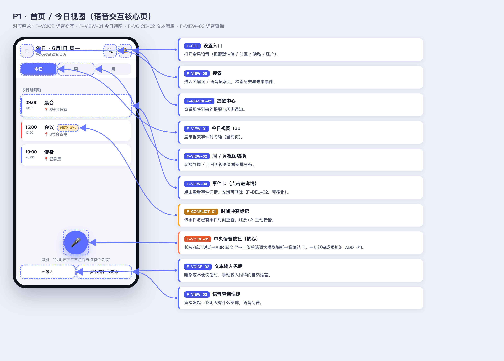
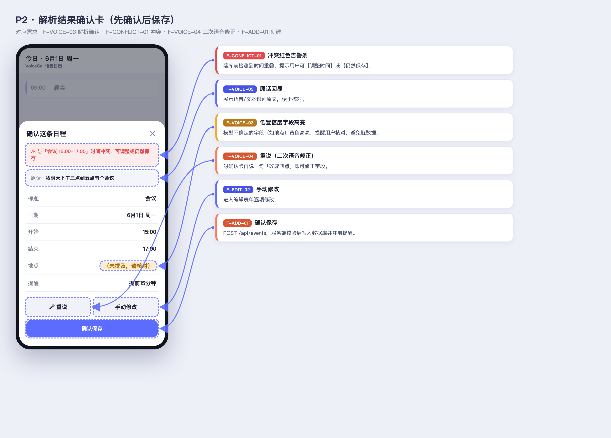
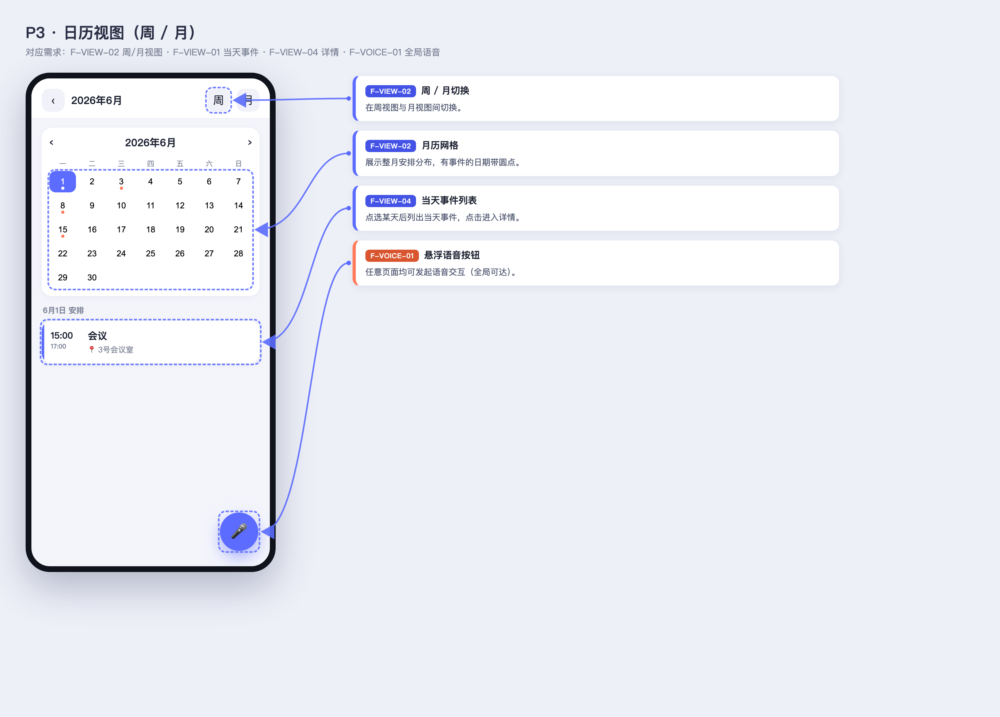
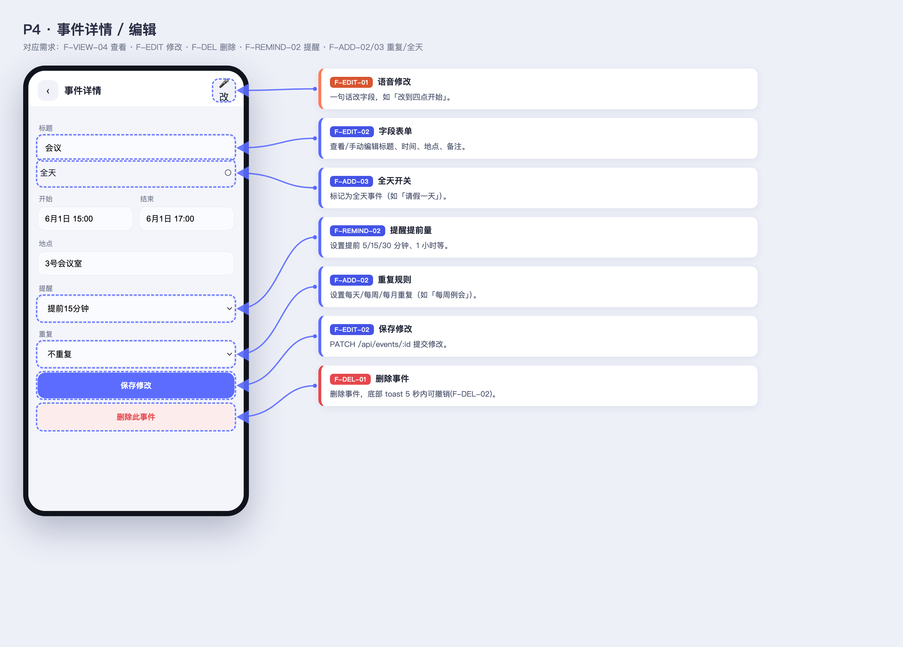
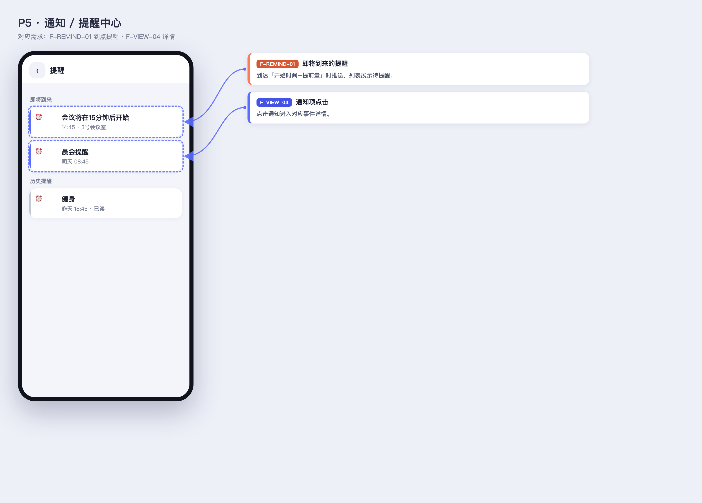
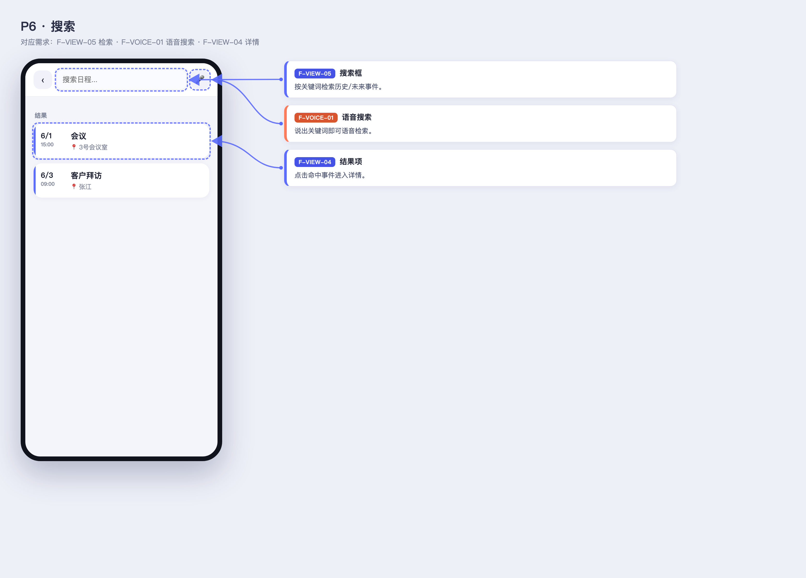
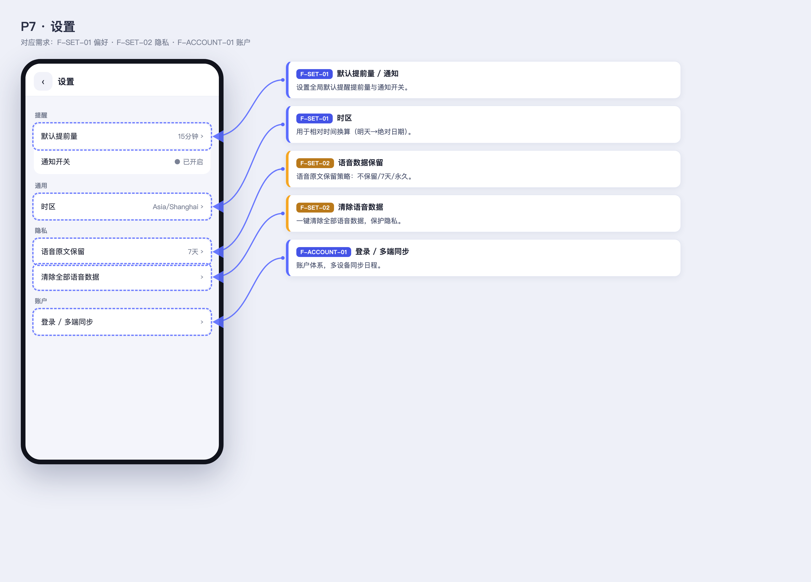

# 语音日历 VoiceCal —— 页面功能标注图

> 基于可交互原型 `prototype/index.html` 逐页截图，并把 `01-需求文档(PRD).md` / `03-页面设计.md` 中的功能编号一一标注到对应控件上。
> 每张图：左侧为页面截图（控件带虚线高亮框），右侧为功能卡片（`需求编号 + 名称 + 说明`），箭头指向对应控件。
> 重新生成：用浏览器打开 `prototype/annotate.html?p=<页面>`，或参见本文末尾命令。

---

## P1 · 首页 / 今日视图（语音交互核心页）


## P2 · 解析结果确认卡（先确认后保存）


## P3 · 日历视图（周 / 月）


## P4 · 事件详情 / 编辑


## P5 · 通知 / 提醒中心


## P6 · 搜索


## P7 · 设置


---

## 颜色图例
- **蓝色卡片**：查看 / 通用类功能（F-VIEW、F-SET、F-EDIT…）
- **橙色卡片**：语音 / 添加类核心功能（F-VOICE、F-ADD）
- **红色卡片**：删除 / 冲突类（F-DEL、F-CONFLICT）
- **黄色卡片**：需要用户核对 / 隐私提示（低置信度高亮、语音数据保留）

## 重新生成命令
```bash
cd Calendar
CHROME="/Applications/Google Chrome.app/Contents/MacOS/Google Chrome"
BASE="file://$(pwd)/prototype/annotate.html"
for spec in "home:页面标注-P1-首页今日视图" "confirm:页面标注-P2-解析确认卡" \
  "calendar:页面标注-P3-日历视图" "event:页面标注-P4-事件详情编辑" \
  "notifications:页面标注-P5-提醒中心" "search:页面标注-P6-搜索" "settings:页面标注-P7-设置"; do
  p="${spec%%:*}"; name="${spec##*:}";
  "$CHROME" --headless=new --disable-gpu --hide-scrollbars --force-device-scale-factor=2 \
    --window-size=1560,1120 --virtual-time-budget=2500 \
    --screenshot="docs/${name}.png" "${BASE}?p=${p}";
done
```
